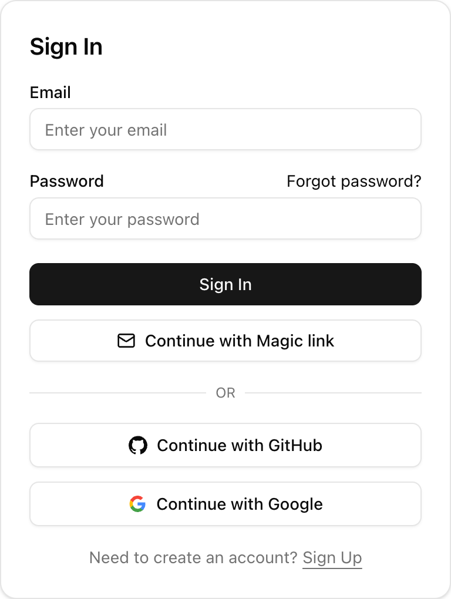
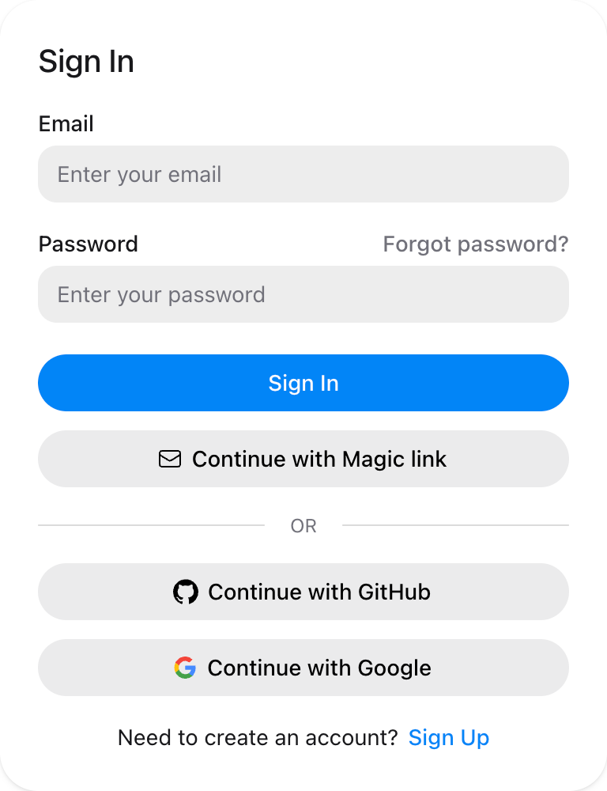

# Better Auth UI

Authentication components and data utilities for [Better Auth](https://better-auth.com), available for React and Solid.

[Documentation](https://better-auth-ui.com/docs) · [Demo](https://demo.better-auth-ui.com) · [Discord](https://better-auth-ui.com/discord)

Better Auth UI provides complete authentication flows, account settings, plugin integrations, and reusable data APIs. Choose the UI that fits your application:

- **shadcn/ui** provides React components that you copy into your project.
- **HeroUI** provides packaged React components built with HeroUI v3.
- **Zaidan Solid** provides Solid components that you copy into your project.
- **React and Solid packages** provide hooks, queries, mutations, and server helpers for custom interfaces.

## Features

- Sign-in, sign-up, email verification, and password recovery flows
- User profiles, account settings, session management, and security controls
- Integrations for Better Auth plugins such as organizations, passkeys, two-factor authentication, magic links, and API keys
- Query and mutation APIs for React and Solid
- Server-rendering helpers and customizable email templates
- Light and dark themes with full control over copied component code

## Preview

### shadcn/ui

<picture>
  <source srcset="./apps/docs/public/screenshots/shadcn-sign-in-dark.png" media="(prefers-color-scheme: dark)">
  <source srcset="./apps/docs/public/screenshots/shadcn-sign-in-light.png" media="(prefers-color-scheme: light)">
  
</picture>

### HeroUI

<picture>
  <source srcset="./apps/docs/public/screenshots/heroui-sign-in-dark.png" media="(prefers-color-scheme: dark)">
  <source srcset="./apps/docs/public/screenshots/heroui-sign-in-light.png" media="(prefers-color-scheme: light)">
  
</picture>

## Quick start

Install [Better Auth](https://www.better-auth.com/docs/installation). Then configure it for your application before you add a UI package.

### shadcn/ui

Add the authentication components to an existing shadcn/ui project:

```bash
bunx --bun shadcn@latest add @better-auth-ui/auth
```

Read the [shadcn/ui quick start](https://better-auth-ui.com/docs/shadcn) for framework setup and optional components.

### HeroUI

Install the HeroUI package and its Better Auth UI dependencies:

```bash
bun add @better-auth-ui/heroui@latest @better-auth-ui/react@latest @better-auth-ui/core@latest
```

Import the component styles in your global CSS file:

```css
@import "@better-auth-ui/heroui/styles";
```

Read the [HeroUI quick start](https://better-auth-ui.com/docs/heroui) for provider and framework setup.

### Zaidan Solid

Install the Solid data layer and its runtime dependencies:

```bash
bun add @better-auth-ui/solid @tanstack/solid-query better-auth solid-js
```

Then add the authentication components from the Solid registry:

```bash
bunx --bun shadcn@latest add https://better-auth-ui.com/r/solid/auth.json
```

Read the [Zaidan Solid quick start](https://better-auth-ui.com/docs/zaidan) for TanStack Start setup and optional components.

## Package reference

| Package | Purpose |
| --- | --- |
| `@better-auth-ui/core` | Shared query options, server helpers, types, and framework-independent utilities |
| `@better-auth-ui/react` | React providers, hooks, queries, mutations, and plugin APIs |
| `@better-auth-ui/heroui` | Ready-to-use React components built with HeroUI |
| `@better-auth-ui/solid` | Solid providers, hooks, queries, mutations, and plugin APIs |
| `@better-auth-ui/locales` | Locale bundles, language matching helpers, and the localization skill |

See the [React reference](https://better-auth-ui.com/docs/react) or [Solid reference](https://better-auth-ui.com/docs/solid) when you need lower-level APIs.

## Agent skills

Better Auth UI publishes the same agent skills through TanStack Intent and [skills.sh](https://skills.sh).

For GitHub installation, select the skill for your application:

```bash
bunx skills@latest add better-auth-ui/better-auth-ui --full-depth --skill better-auth-ui-react
```

Skills cover React/shadcn, Solid/Zaidan, HeroUI, core data APIs, and localization. TanStack Intent loads them from installed npm packages.

Read the [agent skills guide](https://better-auth-ui.com/docs/agent-skills) for both installation paths and their version behavior.

## Development

This repository uses [Bun](https://bun.sh) and [Nx](https://nx.dev).

Install the workspace dependencies:

```bash
bun install
```

Start the development projects:

```bash
bun run dev
```

Run the main workspace tasks:

```bash
bun run build
bun run test
```

## Community

Join the [Better Auth UI Discord](https://better-auth-ui.com/discord) to ask questions, share feedback, and connect with contributors.

## License

Better Auth UI is available under the [MIT License](./LICENSE).
